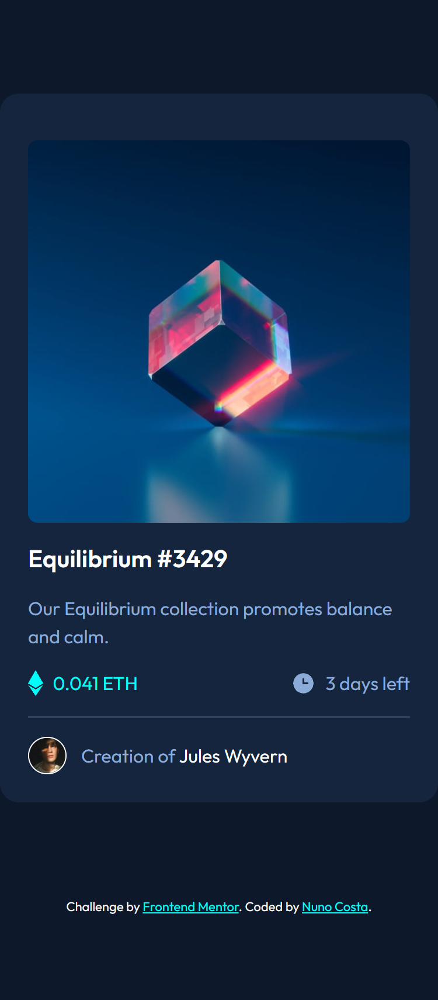

# Frontend Mentor - NFT preview card component solution

This is a solution to the [NFT preview card component challenge on Frontend Mentor](https://www.frontendmentor.io/challenges/nft-preview-card-component-SbdUL_w0U). Frontend Mentor challenges help you improve your coding skills by building realistic projects.

## Table of contents

- [Overview](#overview)
  - [The challenge](#the-challenge)
  - [Screenshot](#screenshot)
  - [Links](#links)
- [My process](#my-process)
  - [Built with](#built-with)
  - [What I learned](#what-i-learned)
  - [Continued development](#continued-development)
  - [Useful resources](#useful-resources)
- [Author](#author)
- [Acknowledgments](#acknowledgments)

## Overview

### The challenge

Users should be able to:

- View the optimal layout depending on their device's screen size
- See hover states for interactive elements

### Screenshot

<h4 align="center"><strong>Mobile/Desktop Design</strong></h4>

<p align="center">


### Links

- Solution URL: [Add solution URL here](https://your-solution-url.com)
- Live Site URL: [Add live site URL here](https://your-live-site-url.com)

## My process

### Built with

- Semantic HTML5 markup
- CSS custom properties
- Flexbox

### What I learned

This project was not very challenging but thanks to this project I got a deeper understanding of the ::before and ::after pseudo-classes.

```css
.app__info-equilibrium-wrapper:hover::after {
  content: url("/icon-view.svg");
  background-color: var(--clr-cyan-transparent);
  width: 100%;
  height: 100%;
  position: absolute;
  top: 0;
  left: 0;
  z-index: 1;
  border-radius: 8px;
  transition: background-color 0.3s;
  display: flex;
  justify-content: center;
  align-items: center;
  cursor: pointer;
}
```

### Continued development

In the next days my goal is to keep on doing relatively easy challenges in order to gain an in-depth knowledge of the relatively basic topics.

### Useful resources

- [Image hover state resource](https://www.youtube.com/watch?v=dLDn_k8GmaU&t=2466s) - This video helped me achieve the hover state for the main image of the website (at around 1:27:28).

## Author

- Frontend Mentor - [@Bottom17](https://www.frontendmentor.io/profile/Bottom17)

## Acknowledgments

Even though I dont know this person, I really want to take some time to give appreciate the youtuber [Slaying The Dragon](https://www.youtube.com/@slayingthedragon) for his amazing videos. I have learned a lot thanks to him, so once again thank you very much 😊!
